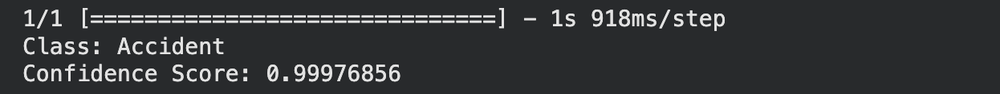
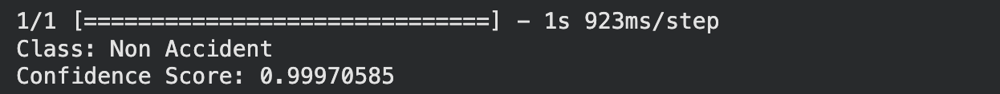

# Car Accident Detection Model

An image classification model that detects whether a car in an image is involved in an accident or not. The model was trained using Google Teachable Machine.

## Classes
1. Accident - images of cars involved in an accident
2. No_Accident - images of cars with no accident

## Project Steps

### 1. Data Collection
Images for both classes were collected from [Kaggle - Accident Detection From CCTV Footage](https://www.kaggle.com/datasets/ckay16/accident-detection-from-cctv-footage).

### 2. Model Training
- The model was trained using [Teachable Machine by Google](https://teachablemachine.withgoogle.com/) - Image Project, Standard image model
- Images for both classes were uploaded and the model was trained
- The model was evaluated using the Preview tool to verify classification accuracy

### 3. Model Export
The model was exported in TensorFlow to Keras format, producing the following files:
- keras_model.h5
- labels.txt

### 4. Prediction Script
A Python notebook (car_accident_detection.ipynb) was written to:
- Load the trained model
- Accept an input image
- Predict the image class (Accident / No_Accident) along with a confidence score

The notebook was run on Google Colab.

## Results

Two test images were used to evaluate the model:

| Test Image | Predicted Class |
|---|---|
| accident_test.jpg | Accident |
| no_accident_test.jpg | No_Accident |

Screenshots of both predictions are included in this repository as proof of the model's output:

**Accident prediction**



**No accident prediction**



## Repository Contents

| File | Description |
|---|---|
| car_accident_detection.ipynb | Python notebook that loads the model and predicts the image class |
| keras_model.h5 | Trained model exported from Teachable Machine |
| labels.txt | Class names (Accident / No_Accident) |
| output_accident.png | Output screenshot for the accident test image |
| output_no_accident.png | Output screenshot for the no accident test image |

## How to Run

1. Open car_accident_detection.ipynb in Google Colab
2. Run the first cell to install dependencies:

```bash
pip install tensorflow tf_keras pillow numpy
```

3. Upload keras_model.h5, labels.txt, and the test image when prompted
4. Run the remaining cells to get the predicted class and confidence score

## Tools Used
- Google Teachable Machine (model training)
- TensorFlow / Keras (model loading and prediction)
- Google Colab (running the script)
- Python (PIL, NumPy)
